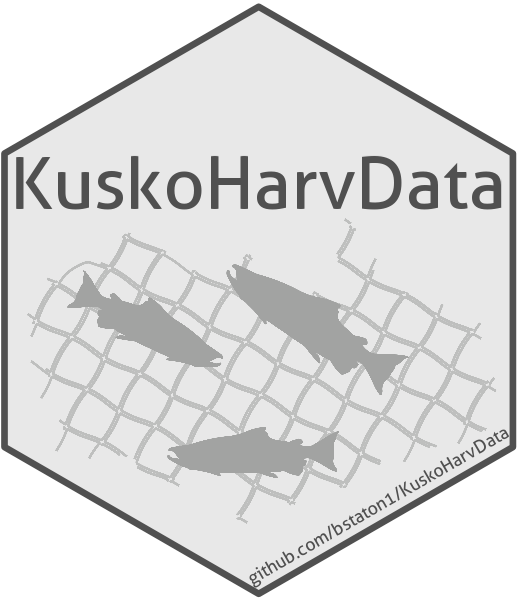

# KuskoHarvData 

> R package that stores data collected by the Lower Kuskokwim River In-season Subsistence Salmon Harvest Monitoring Program.
> In addition to the raw data, included are compiled estimates of harvest (by species and area) and effort (by area) for each monitored drift gillnet subsistence opener (estimates generated using the '[KuskoHarvEst](https://github.com/bstaton1/KuskoHarvEst)' R package).
>
> Prior to the development of 'KuskoHarvData', these data had been stored in separate places and in various formats.
> This new standardized and comprehensive format facilitates analyses that may provide greater insights about fishery management in the lower Kuskokwim River, such as those contained in the ['KuskoHarvPred'](https://github.com/bstaton1/KuskoHarvPred) R package. 

A description of the sampling methodology and estimation framework can be found in the manuscript:

> Staton, B.A., Bechtol, W.R., Coggins, L.G., Jr., and Decossas, G., and Esquible, J. (In Review). _In-season monitoring of harvest and effort from a large-scale subsistence salmon fishery in western Alaska._ Submitted to _Canadian Journal of Fisheries and Aquatic Sciences_, December 2023.

An example application of these data to inform management decisions can be found in the manuscript:

> Staton, B.A., Bechtol, W.R., Coggins, L.G., Jr., and Decossas, G. (In Review). _In-season predictions of daily harvest for lower Kuskokwim River subsistence salmon fisheries._ Submitted to _North American Journal of Fisheries Management_, July 2024.

## Installation

After installing [R](https://cran.rstudio.com/) and [RStudio Desktop](https://posit.co/download/rstudio-desktop/) (accept all defaults when prompted), run this code from the R console:

```R
install.packages("remotes")
remotes::install_github("bstaton1/KuskoHarvData", build_vignettes = TRUE)
```

## Data Sets

'KuskoHarvData' ships with several data sets, which are all described in the vignette:

```R
vignette("datasets", package = "KuskoHarvData")
```

Briefly, these include:

| Data Set                  	| Description                                                                                                                                                              	|
|---------------------------	|--------------------------------------------------------------------------------------------------------------------------------------------------------------------------	|
| `meta`                    	| Meta data for each drift gillnet subsistence fishery opener.                                                                                                             	|
| `harv_est_all` 	| Compiled estimates of salmon harvest by drift gillnet boats by opener, species, and geographic stratum. Includes point estimates and bootstrap 95% confidence intervals. 	|
| `effort_estimate_master`  	| Compiled estimates of the number of drift gillnet trips by opener and geographic stratum.                                                                                	|
| `interview_data_all`   	| Completed trip interview records documenting interview location, start/end times of the trip, gear and drift characteristics, and salmon catch by species.               	|
| `flight_data_all`      	| Instantaneous aerial counts of active drift gillnet trips by geographic stratum.                                                                                         	|
| `btf_master`              	| Daily Bethel Test Fishery catch-per-unit-effort by species.                                                                                                              	|
| `weather_data_master`     	| Daily summaries of weather variables, as measured at the Bethel Airport (PABE).                                                                                          	|
Source information for each data set can be found in the package help files, for example, to learn about where the interview data come from, run:

```R
?KuskoHarvData::interview_data_all
```

## Accessing the Data

A data set can be loaded into the R session as a data object.
For example, to load the estimates of harvest by opener, stratum, and species, run:

```R
data("harv_est_all", package = "KuskoHarvData")
```

And refer to the object as `harv_est_all` in your session.

Another useful feature is the `KuskoHarvData::prepare_regression_data()` function, which creates the data set used in the regression analyses found in ['KuskoHarvPred'](https://github.com/bstaton1/KuskoHarvPred).

## Updating the Data

It is the intent of the package developer that the data sets be updated with the most current data.
Following the conclusion of each season and after the data sets are finalized for each monitored, the package should be updated such that it contains the same information as is used in the season-wide final report.

Please see the vignette for instructions about how this should be done.

```R
vignette("updating-data", package = "KuskoHarvData")
```

## Contact

Questions or feedback about the data sets or how to use the 'KuskoHarvPred' package may be directed to [Ben Staton](https://github.com/bstaton1) (<bstaton.qes@gmail.com>).

## Acknowledgements

Many organizations and people have collected the data that are contained in this package. These include staff from: the [Orutsararmiut Native Council](https://orutsararmiut.org/) (interviews at the Bethel boat harbor and surrounding fish camps), the [Kuskokwim River Inter-Tribal Fish Commission](https://www.kuskosalmon.org/) (interviews at various villages), the [Alaska Department of Fish and Game](https://www.adfg.alaska.gov/) (interviews at various villages, 2018 only; Bethel Test Fishery), and the [Yukon Delta National Wildlife Refuge/USFWS](https://www.fws.gov/refuge/yukon-delta) (aerial counts). 
The graphic of the salmon caught in the gillnet in the 'KuskoHarvData' package logo was created by N. Tamburello.

Funding for the compilation of existing data sets into this package was provided by the [Arctic-Yukon-Kuskokwim Sustainable Salmon Initiative](https://www.aykssi.org/), administered by the [Bering Sea Fisherman's Association](https://www.bsfaak.org/) under project [#AC-2106](https://www.aykssi.org/project/kuskokwim-river-harvest-prediction-tools/).
